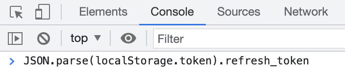

# Cloud-Sync

定时同步文件至阿里云盘


### **使用步骤**

1. Clone仓库到本地

    ```sh
    $ git clone https://github.com/klaxonz/cloud-sync.git
    $ pip install -r requirements.txt
    ```

2. 修改配置文件

    配置文件在根目录，文件名称为config.ini

    | 配置名称         | 是否必填 | 描述                                                         |
    | ---------------- | -------- | ------------------------------------------------------------ |
    | refresh_token    | 是       | 阿里云盘刷新令牌                                             |
    | encrypt_password | 否       | 设置了会自动加密上传到阿里云盘，下载时会自动解密，默认不设置 |
    | remote_path      | 是       | 同步至阿里云盘的目录                                         |
    | local_path       | 是       | 同步至阿里云盘的本地目录                                     |
    | download_path    | 是       | 从阿里云盘下载文件到本地的目录                               |

3. 获取refresh_token

   使用者可以用下面的方式获取用户的 `refresh_token` 值。

   1. 登录 https://www.aliyundrive.com/drive/
   2. 打开浏览器的开发者工具(如 Chrome DevTools)。
   3. 然后选择开发者工具的 Console 面板。输入 `JSON.parse(localStorage.token).refresh_token`，再回车，获取 `refresh_token`。
       

4. 执行脚本

    ```
    $ cd scripts
    $ sh ./upload.sh
    ```

5. 定时任务

    5.1 打开终端并输入以下命令以编辑 cron 作业表

    ```
    $ crontab -e
    ```

    5.2 在编辑器中，添加一个新的 cron 作业

    ```
    # 例如，每隔两小时执行一次
    0 */2 * * * /bin/bash /path/to/your/upload.sh
    ```

    

### 版权说明

该项目签署了MIT 授权许可，详情请参阅 [LICENSE.txt](https://github.com/shaojintian/Best_README_template/blob/master/LICENSE.txt)


### 鸣谢
[AliPCS-Py](https://github.com/PeterDing/AliPCS-Py)
